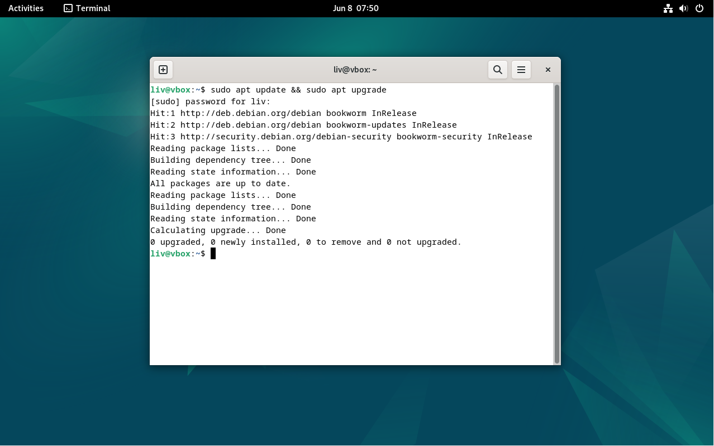
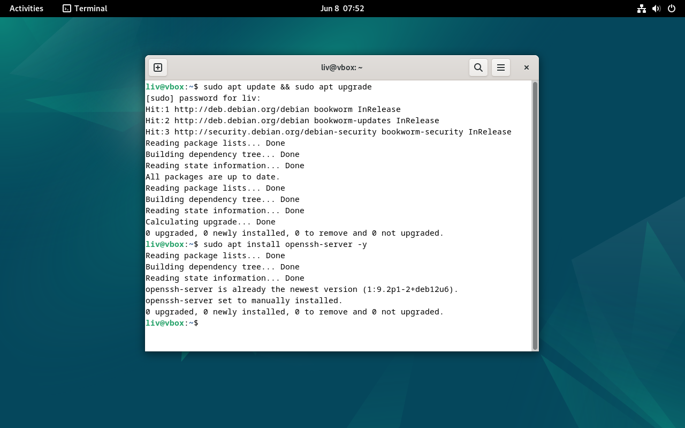
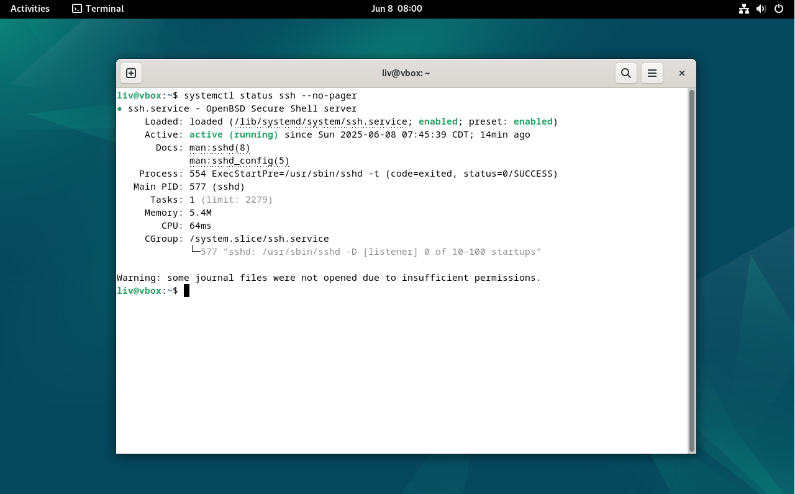
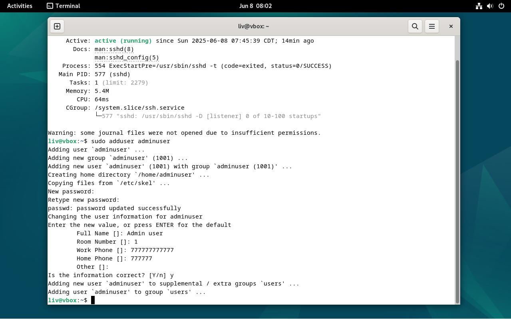
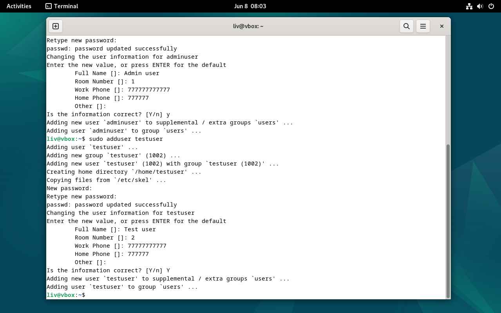
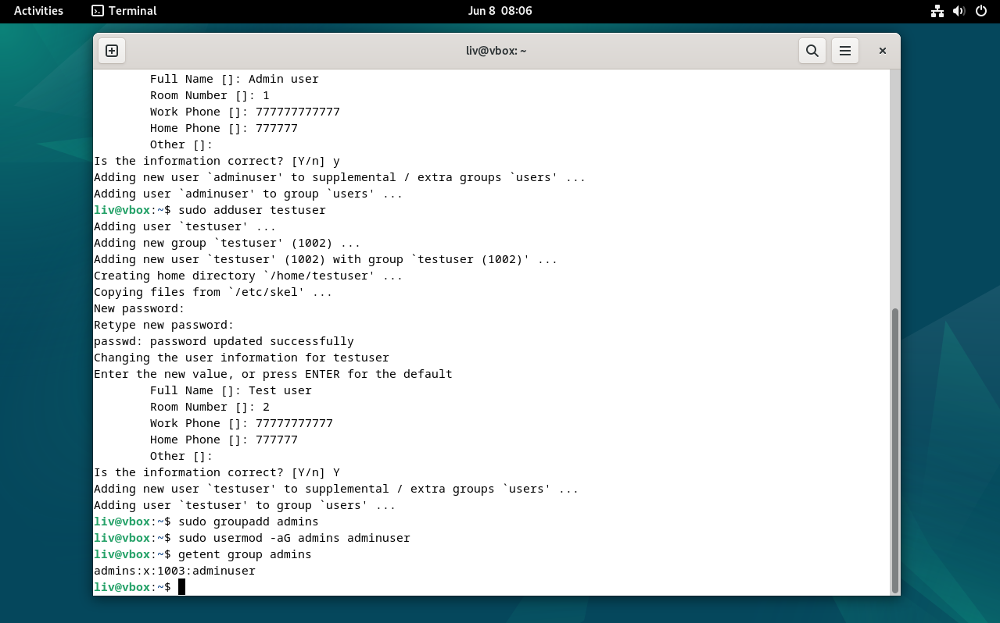
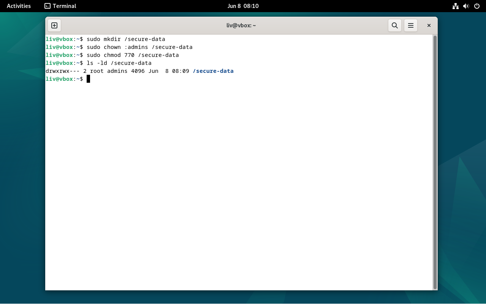
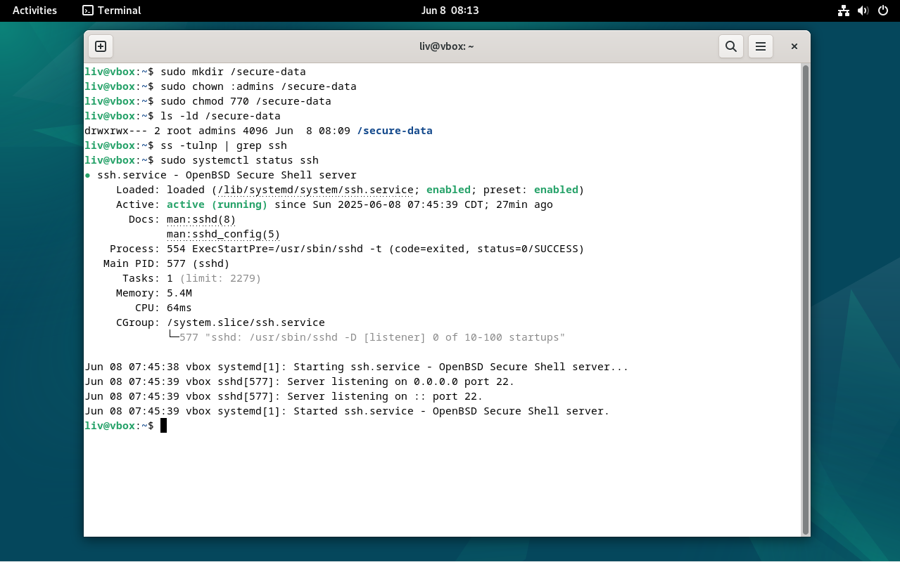

# Lab 1 – Linux SSH, Users, Groups, and Secure Directory Access

This lab demonstrates the setup of a basic Linux server with SSH, user/group management, and directory access control.

## 🧾 Overview

- Updated system packages
- Installed and verified SSH server
- Created new users and groups
- Assigned permissions and verified secure access

## 🛠 Tools Used

- Debian 12 (VirtualBox VM)
- Terminal
- SSH
- Built-in Linux user/group utilities

## 📸 Screenshots

| Step | Description                                 | Screenshot |
|------|---------------------------------------------|------------|
| 1    | Update & Upgrade packages                   |  |
| 2    | Install OpenSSH Server                      |  |
| 3    | Verify SSH service status (clean output)    |  |
| 4    | Add new user: `adminuser`                   |  |
| 5    | Add new user: `testuser`                    |  |
| 6    | Add `adminuser` to `admins` group           |  |
| 7    | Confirm access rights for `/secure-data`    |  |
| 8    | Final check: SSH service is running         |  |

---

📁 All screenshots are located in the `screenshots/` folder.
